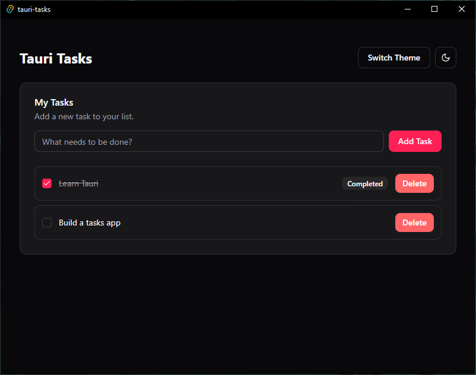

# Tauri Tasks



A modern, cross-platform desktop task management application built with Tauri, React, and shadcn/ui. This project serves as a comprehensive example of building a polished desktop app with a web-based frontend.

[](https://opensource.org/licenses/MIT)

## ✨ Features

* **Cross-Platform:** Runs natively on Windows, macOS, and Linux thanks to Tauri.
* **Modern UI:** Clean and responsive interface built with React and styled with shadcn/ui and Tailwind CSS.
* **Dual Theming:** Includes both a light and dark mode, plus multiple accent color themes (Default, Violet, Slate).
* **Full CRUD Functionality:** Create, read, update (mark as complete), and delete tasks.
* **Safe Deletion:** Features a confirmation dialog to prevent accidental task deletion.
* **Professional Components:** Utilizes themed components for alerts, badges, dialogs, and more.

## 🛠️ Tech Stack

* **Core Framework:** [Tauri](https://tauri.app/)
* **Frontend:** [React](https://reactjs.org/) with [Vite](https://vitejs.dev/)
* **UI Components:** [shadcn/ui](https://ui.shadcn.com/)
* **Styling:** [Tailwind CSS](https://tailwindcss.com/)
* **Icons:** [Lucide React](https://lucide.dev/)

## 🚀 Getting Started

To get a local copy up and running, follow these simple steps.

### Prerequisites

You must have Rust and Node.js installed on your system. Follow the official [Tauri prerequisite guide](https://tauri.app/v1/guides/getting-started/prerequisites) for your operating system.

### Installation

1.  Clone the repo:
    ```sh
    git clone [https://github.com/YourUsername/tauri-tasks.git](https://github.com/YourUsername/tauri-tasks.git)
    ```
2.  Navigate into the project directory:
    ```sh
    cd tauri-tasks
    ```
3.  Install NPM packages:
    ```sh
    npm install
    ```
4.  Run the app in development mode:
    ```sh
    npm run tauri dev
    ```

## 📄 License

This project is licensed under the MIT License - see the [LICENSE](LICENSE) file for details.

## 🙏 Acknowledgments

* The [Tauri Team](https://github.com/tauri-apps) for creating an amazing framework for desktop apps.
* [Shadcn](https://github.com/shadcn) for the incredible UI components.